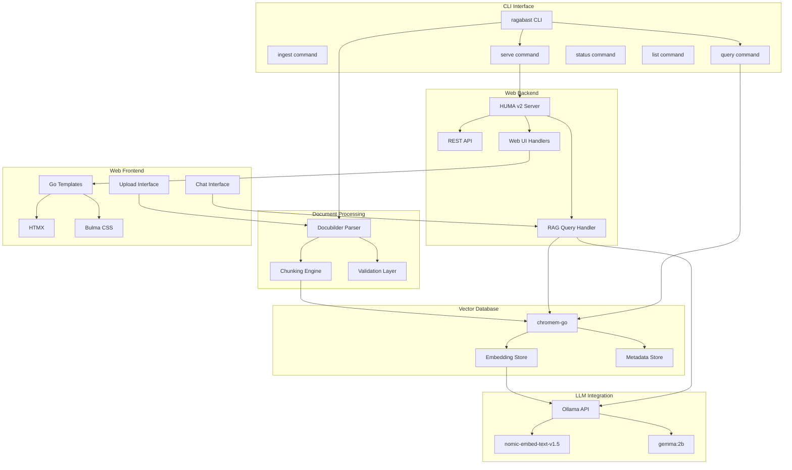

# RAG/LLM System Architecture

## System Overview

## Data Flow

1. **Document Ingestion**: 
   - Docubilder Markdown → Parser → Chunker → Embeddings → Vector DB

2. **Query Processing**:
   - User Query → Embedding → Vector Search → Context Retrieval → LLM Generation → Response

3. **Web Interface**:
   - Browser → HTMX → Server → API/LLM → Templates → Browser

## Component Responsibilities

- **Models**: Data structures and types
- **Parser**: Frontmatter extraction and Markdown parsing
- **Chunker**: H1/H2-based splitting with context preservation
- **Vector DB**: chromem-go wrapper for storage and search
- **LLM Client**: Ollama API integration for embeddings and generation
- **CLI**: Command-line interface for all operations
- **Server**: HTTP server with REST API and web UI
- **Templates**: HTMX-powered responsive frontend