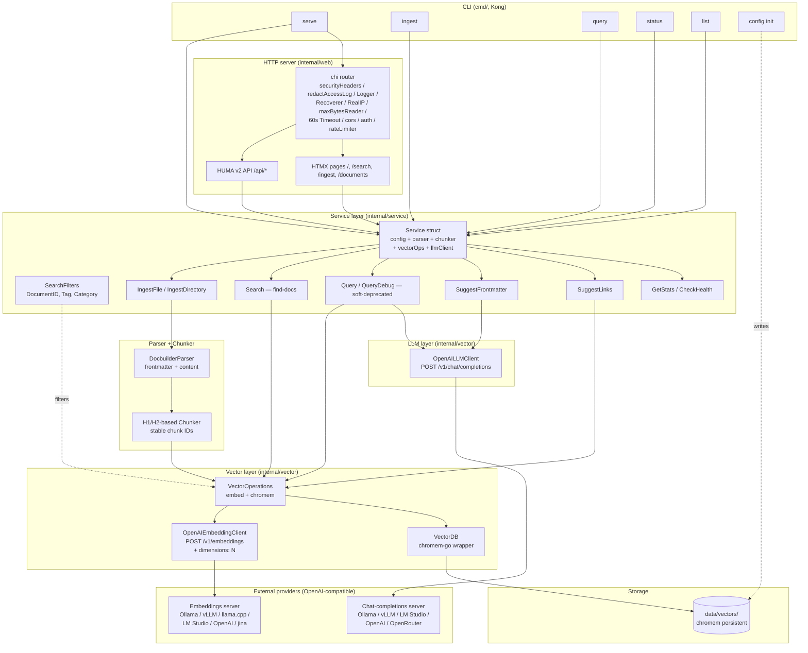

# RAG/LLM System Architecture

> Snapshot of the code as it actually exists — OpenAI-compatible HTTP providers,
> `Service`-shaped core, `chromem-go` storage, HUMA v2 API, HTMX/Bulma web UI.
> This document is a map; it is not a plan.

## System Overview

## Layers

### CLI (`cmd/`)

- Parsed with Kong; each command is a struct field on `CLI` in `cmd/root.go`.
- Subcommands: `serve`, `ingest`, `query`, `status`, `list`, `config init`
  (alias: `init`).
- All non-`serve` commands share `withService` to construct a `*Service`
  from a `config.Config` and tear it down on exit. `ServeCmd` deliberately
  bypasses that helper so the long-running web process owns its own
  lifecycle.

### Service (`internal/service/`)

- `Service` is the single wiring root. `NewService(cfg)` builds the
  vector DB, embeddings client, vector operations, parser, chunker, and
  LLM chat client **once**; everything downstream reuses those instances.
- The package is split by responsibility (recently de-god-filed): the
  type and constructor live in `service.go`; ingest in `ingest.go`;
  search/query in `query.go`; LLM helpers in `llm.go`; prompt assembly
  in `prompt.go`; frontmatter suggestion in `frontmatter.go` +
  `frontmatter_parse.go`; link extraction/policy in `links_extract.go`
  + `links_policy.go`; catalog stats in `catalog.go` + `stats.go`;
  query context building in `query_context.go`; document listing in
  `documents.go`.
- Public surface (consumed by `internal/web` through the `serviceAPI`
  interface in `huma_helpers.go`):

  | Method | Purpose |
  |---|---|
  | `IngestFile(ctx, filePath) error` | One file off disk. |
  | `IngestDirectory(ctx, dirPath) (IngestResult, error)` | Walks a directory and ingests every `.md`; returns aggregate counts. |
  | `IngestDocument(ctx, content) (*models.Document, error)` | Raw markdown string. |
  | `Search(ctx, query, limit, filters)` | **Find-docs entry point.** Embed query, retrieve top-K with optional filters, return raw `[]SearchResult` without an LLM call. |
  | `Query`, `QueryDebug`, `QueryDebugWithOptions` | Chat-mode RAG. Soft-deprecated: prefer `Search` for retrieval-only callers. A one-shot warning is logged per process to nudge migrations. |
  | `SuggestFrontmatter(ctx, doc)` | LLM-assisted `description`/`categories`/`tags`/`custom_tags` suggestion; parser tolerates unstructured LLM output via `constructJSONFromText`. |
  | `SuggestLinks(ctx, query)` | Returns link URLs extracted from the top retrieved chunks. |
  | `GetNormalizedTags`, `GetNormalizedCategories`, `GetTagsAndCategories` | Catalog lookups over the vector store metadata. |
  | `GetUniqueDocuments` | List ingested documents for `/documents`. |
  | `GetStats` | Doc count, model keys, etc. Used by `status`. |
  | `CheckHealth` | Round-trip ping for `/api/health`. |

- The `SearchFilters` struct (`DocumentID`, `Tag`, `Category`) is the
  modern way to scope a search; it converts to a `chromem-go` `Where`
  filter via `toWhere`.

### Parser + Chunker

- `parser.DocbuilderParser` understands the docbuilder Markdown format:
  YAML frontmatter + body. Stable document IDs come from the docbuilder
  UID; `Fingerprint` is a content hash and is auto-computed when the
  doc sets the `"auto-generated-if-empty"` placeholder.
- `chunker.Chunker` splits on H1/H2 headers, enforces `min/max` sizes
  with overlap, and produces **stable chunk IDs** via SHA-256 over
  `(documentID, headerPath, startLine, endLine, content)`. Stable IDs
  make repeated ingests dedupe-friendly (the same document chunk is
  replaced, not duplicated).

### Vector layer (`internal/vector/`)

- `OpenAIEmbeddingClient` and `OpenAILLMClient` are thin HTTP clients
  for the OpenAI `/v1/embeddings` and `/v1/chat/completions` endpoints
  respectively. Both share an `applyAuth` helper that sends
  `Authorization: Bearer <key>` when a key is configured. Base URLs
  that already include `/v1` are accepted as-is; bare hostnames get
  `/v1` appended.
- **Embedding client** carries a Matryoshka knob: when
  `dimensions > 0` it injects `dimensions: N` into every request body
  (jina v5 / OpenAI text-embedding-3-* truncate the returned vector).
  When the server ignores the field, the client logs a one-shot
  `DIMENSION MISMATCH` warning.
- `VectorOperations` wraps `VectorDB` + the embedding client: every
  store path embeds via the client; every search path embeds the query
  then queries the DB.
- `VectorDB` is the `chromem-go` wrapper. Persistent by default
  (`data/vectors/`); falls back to in-memory when the directory is
  empty. Supports chunk add/get/delete, document-level delete,
  per-chunk metadata (`tags`, `categories`, `document_id`,
  `document_title`, `header_path`, `fingerprint`), `Where` filtering,
  and a fingerprint-based `DocumentNeedsUpdate` check used by ingest
  to skip unchanged files.
- Per-provider API keys: `ollama.api_key` (default), `ollama.chat_api_key`
  and `ollama.embedding_api_key` (overrides). The same Ollama server
  can host both providers; OpenAI / jina are equally valid.

### Storage

- Vector embeddings + per-chunk metadata are persisted by `chromem-go`
  to `data/vectors/`. Deleting that directory forces re-ingestion on
  next start.
- `vectordb.embedding_dimension` **must match the dimension of the
  vectors that land in the collection** — i.e. the truncated dimension
  when Matryoshka is enabled, not the model's full dimension.

### HTTP server (`internal/web/`)

- `chi` router. Middleware chain (in order, each file documents its own
  purpose):

  | Middleware | File | Purpose |
  |---|---|---|
  | `securityHeadersMiddleware` | `security_headers.go` | Adds CSP, X-Content-Type-Options, X-Frame-Options, Referrer-Policy, HSTS on every response. |
  | `redactAccessLogMiddleware` | `redact_log.go` | Rewrites `r.URL.RawQuery` to redact `query`, `message`, `text`, `content`, `document_id`, `docbuilder_base_url` values before chi's logger runs. |
  | `middleware.Logger` | chi | Access log (now reading the redacted URL). |
  | `middleware.Recoverer` | chi | Catches panics; returns 500. |
  | `middleware.RealIP` | chi | Populates `r.RemoteAddr` from `X-Forwarded-For` (chi v5.3.0+ validates trusted proxies; do not expose chi directly without a trusted proxy). |
  | `maxBytesReaderMiddleware` | `max_bytes.go` | Wraps every request body with `http.MaxBytesReader` at 10 MiB. |
  | `middleware.Timeout(60s)` | chi | Cancels handler context after 60s. |
  | `corsMiddleware` | `cors.go` | Allow-list CORS (replaces the previous wildcard). `cors_origins` empty disables cross-origin browser requests. |
  | `authMiddleware` | `auth.go` | Bearer-token auth via `Authorization: Bearer <token>`; constant-time compare. Skipped on public routes (HTML GETs, `/static/*`, OPTIONS). |
  | `llmRateLimiter.llmPathMiddleware` | `rate_limit.go` | Per-IP token-bucket on the LLM-backed paths only (`/api/query`, `/api/search`, `/api/link-suggestions`, `/api/frontmatter/suggest`, `/chat/message`, `/search`); `429` + `Retry-After` when the bucket is empty. |

- The `http.Server` literal in `Start()` applies the configured
  `ReadTimeout`, `WriteTimeout`, plus a fixed 120 s `IdleTimeout`. Slowloris
  and slow-body attacks cannot pin connections open indefinitely.
- `service.SaveConfig` writes `config.yml` with mode `0o600`. Operators do
  not have to remember to `chmod` after `config init`.
- HUMA v2 is mounted via the chi adapter. Each resource gets its own
  `huma_*.go` file and its own `register*Operations` function:

  | File | Registers |
  |---|---|
  | `huma_chi.go` | `registerHumaAPI` (HUMA ↔ chi adapter, `/docs`) |
  | `huma_api.go` | `registerHumaOperations` — wires every other file together, plus the global `serviceAPI` contract |
  | `huma_catalog.go` | health, tags, categories, tags-and-categories |
  | `huma_ingest.go` | raw / multipart / file ingest (behind `IngestLimiter`) |
  | `huma_documents.go` | document list / get / prune |
  | `huma_query.go` | `POST /api/query` (chat) + `POST /api/search` (find-docs) |
  | `huma_frontmatter.go` | `POST /api/frontmatter/suggest` |
  | `huma_links.go` | `POST /api/link-suggestions` |

- API routes (auto-documented at `/docs`):

  | Method | Path | Operation |
  |---|---|---|
  | GET | `/api/health` | health |
  | GET | `/api/tags` | normalized tags |
  | GET | `/api/categories` | normalized categories |
  | GET | `/api/tags-categories` | both |
  | POST | `/api/ingest` | ingest one Markdown document |
  | POST | `/api/ingest/raw` | ingest raw Markdown body |
  | POST | `/api/ingest/file` | ingest multipart upload |
  | GET | `/api/documents` | list ingested documents |
  | GET | `/api/documents/{document_id}` | get one |
  | POST | `/api/documents/prune` | delete chunks not present on disk |
  | POST | `/api/query` | chat-mode (soft-deprecated) |
  | POST | `/api/search` | find-docs (recommended) |
  | POST | `/api/frontmatter/suggest` | LLM-assisted frontmatter |
  | POST | `/api/link-suggestions` | link extraction |

- Web UI pages (chi):

  | Method | Path | Handler |
  |---|---|---|
  | GET | `/` | chat page |
  | GET | `/chat` | redirect → `/` |
  | POST | `/chat/message` | HTMX chat reply |
  | GET | `/search` | find-docs search form |
  | POST | `/search` | HTMX search results |
  | GET | `/ingest` | upload form |
  | POST | `/ingest` | HTMX upload result |
  | GET | `/documents` | ingested-document list |
  | GET | `/static/*` | CSS / assets |

- Rendered with `html/template`; styling is Bulma. `renderChatMarkdownToSafeHTML`
  sanitizes LLM output before injection. Server-side errors are logged
  in full but returned to the client as a generic 500.

## Data Flow

1. **Document ingestion**
   - docbuilder Markdown → `DocbuilderParser.ParseDocument` (frontmatter + body) →
     `Chunker.ChunkDocument` (H1/H2 split, stable IDs) →
     `VectorOperations.IngestDocument` (embed via `/v1/embeddings`) →
     `VectorDB.AddChunk` (chromem-go persistent store).

2. **Find-docs search (recommended)**
   - User query → `SearchFilters{DocumentID?, Tag?, Category?}` →
     `OpenAIEmbeddingClient.embed(query)` (Matryoshka `dimensions` if configured) →
     `VectorDB.Search(queryEmbedding, limit, filters)` (chromem-go `Where`) →
     `[]SearchResult` (chunk + metadata + score). **No LLM call.**

3. **Chat-mode query (soft-deprecated)**
   - User message + chat history → `Service.Query` → embed →
     top-K retrieve → assemble context (parent sections, tags, categories,
     URLs) → `OpenAILLMClient.Chat` (chat-completions with system prompt) →
     answer streamed/returned to caller.

4. **Frontmatter suggestion**
   - User pastes raw Markdown body → `Service.SuggestFrontmatter` →
     `OpenAILLMClient.Chat` with a structured-output prompt →
     `parseFrontmatterSuggestionJSON` tolerates free-form LLM output →
     `description`, `categories`, `tags`, `custom_tags` returned.

5. **Web UI**
   - Browser → HTMX → chi → HUMA handler → `serviceAPI` (interface in
     `huma_helpers.go`) → `*Service` method → response (HTML fragment
     or JSON) → HTMX swaps the fragment in place.

## Cross-cutting

- **Configuration**: `config.Config` is a YAML file plus env overrides
  (`OllamaConfig.EffectiveChatAPIKey` / `EffectiveEmbeddingAPIKey`
  resolve per-provider). Sections: `ollama` (legacy naming — actually
  OpenAI-compatible), `vectordb`, `server`, `processing`, `paths`. See
  `config.example.yml` for the annotated template and `README.md` for
  the inline notes about per-provider keys, Matryoshka, and
  re-ingestion requirements.
- **Logging**: standard `log` package; web handlers use `internalError`
  to log the full chain while returning a generic 500. The access logger
  sees a redacted URL — see `redact_log.go` for the list of query keys
  whose values are replaced with `[REDACTED]`.
- **Testing**: testify + humatest. Co-located `*_test.go` files. The
  `serviceAPI` interface lets the web layer be tested with
  `fakeHumaService` in `fakes_test.go` without spinning up a real
  `*Service`.

## Component Responsibilities

| Package | Owns |
|---|---|
| `cmd/` | CLI parsing (Kong), command dispatch, config file bootstrap |
| `internal/config` | YAML/env loading, defaults, validation, `EffectiveAPIKey` resolution |
| `internal/models` | `Document`, `Chunk`, `SearchResult`, `IngestResult`, sentinel errors |
| `internal/parser` | docbuilder Markdown → `*Document` (frontmatter + body + fingerprint) |
| `internal/chunker` | H1/H2 split, stable chunk IDs, size validation |
| `internal/vector` | chromem-go wrapper, embedding client, LLM client, `SearchFilters`-aware `Where` |
| `internal/service` | `Service` wiring + every business operation (ingest, search, query, frontmatter, links, catalog, stats, health) |
| `internal/web` | chi router, HUMA API, HTMX pages, server lifecycle |

## When you change X, expect Y to notice

- Adding a `Config` field → touch `config.example.yml`, the README's
  `ollama.*` notes, and `internal/service/service.go` if it's used by
  `Service`.
- Adding a `Service` method → consider whether the web layer needs it
  (add to `serviceAPI` in `huma_helpers.go`) and whether
  `fakeHumaService` should stub it.
- Changing the embedding wire format → update
  `OpenAIEmbeddingRequest`, `buildEmbeddingBody`, and
  `openaiEmbeddingResponse` together; tests pin each behavior.
- Changing a route path → update the table above, the
  `huma_*Operations` registration, and the web UI's HTMX attributes.
