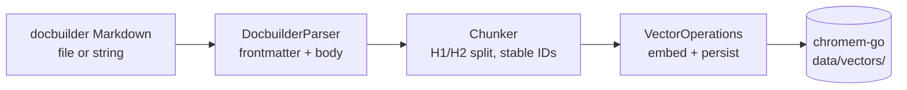

# Ingestion Guide

> How documents move from a file on disk into the vector store. This
> doc covers the format, the three entry points (CLI, web UI, HTTP),
> re-ingest semantics, and what to do when it goes wrong.

## The pipeline

Every ingest path (CLI, web UI, HTTP) ends up at the same service
method:



1. **Parse** — `DocbuilderParser.ParseDocument` splits the document
   into a YAML frontmatter map and a markdown body, validates the
   required fields, computes a fingerprint if one wasn't supplied,
   and extracts the title from the first H1.
2. **Chunk** — `Chunker.ChunkWithHierarchy` splits on H1/H2 headers,
   enforces `processing.min_chunk_size` / `processing.max_chunk_size`
   with `processing.chunk_overlap`, and produces **deterministic
   chunk IDs** (SHA-256 over `documentID|headerPath|startLine|endLine|content`).
3. **Store** — `VectorOperations.IngestDocument` checks
   `DocumentNeedsUpdate`, deletes the old chunks if the fingerprint
   changed, embeds every chunk via the OpenAI-compatible embeddings
   server, and writes them to `chromem-go`.

Source files: `internal/parser/docbuilder.go`, `internal/chunker/chunker.go`,
`internal/service/pipeline.go`, `internal/vector/operations.go::IngestDocument`.

## Document format

ragabast ingests **docbuilder Markdown** — a YAML frontmatter block
followed by a standard Markdown body. The frontmatter is delimited by
`---` lines; both delimiters are required.

### Required frontmatter fields

| Field | Purpose |
|---|---|
| `uid` | Stable document ID. Used as the chromem-go document key and as `SearchFilters.DocumentID`. Two documents with the same `uid` are the same document (re-ingest replaces, never duplicates). |
| `fingerprint` | A SHA-256 of the markdown body. Drives dedupe: identical fingerprint = no-op, different fingerprint = replace. Set the literal string `"auto-generated-if-empty"` (the parser strips it) and ragabast will compute the hash from the content for you. |

### Optional frontmatter fields

| Field | Type | Notes |
|---|---|---|
| `tags` | `[]string` | Free-form labels. Used as `SearchFilters.Tag` and surfaced by `GET /api/tags`. |
| `categories` | `[]string` | Hierarchical classifications. Used as `SearchFilters.Category` and surfaced by `GET /api/categories`. |
| `urls` | `[]string` | At least one is conventional (link-suggestion works better when the document has a canonical URL), but not enforced. |
| `created_at` | RFC 3339 string | Stamped onto each chunk as `DocumentCreatedAt`. |
| `updated_at` | RFC 3339 string | Stamped onto each chunk as `DocumentUpdatedAt`. |

### Body

- Standard Markdown.
- The first H1 (`# ...`) becomes the document title; subsequent H1/H2
  headers define the chunking boundaries. Chunks smaller than
  `processing.min_chunk_size` get merged with their neighbour; chunks
  larger than `processing.max_chunk_size` get split with overlap.
- If the body has no H1, the whole document is a single chunk.
- Frontmatter handling in the strict `ingest` path
  (`DocbuilderParser.ParseDocument`):
  - **No `---` at all** → parses cleanly, but `Document.Validate()`
    rejects with `ErrMissingUID` and `ErrMissingFingerprint`. You
    must add frontmatter to ingest.
  - **`---` opening without a closing `---`** → hard error from
    `extractFrontmatter`: `"frontmatter delimiter not found"`.
  - The lenient helper `parser.SplitDocbuilderFrontmatter` (used by
    the frontmatter-suggest endpoint) treats un-frontmattered content
    as "no fields to merge" rather than failing. Don't rely on that
    behaviour from the `ingest` path.

### Minimal example

```markdown
---
uid: "getting-started"
fingerprint: auto-generated-if-empty
tags:
  - "tutorial"
categories:
  - "Documentation"
urls:
  - "https://example.com/docs/getting-started"
---

# Getting Started

Body starts here.

## First section

Sub-headings define chunk boundaries.
```

The full model is in `internal/models/document.go::Document`; the
frontmatter → struct mapping is in
`internal/parser/docbuilder.go::DocbuilderParser.parseFrontmatter`.

## CLI

The `ingest` command is defined in `cmd/root.go::IngestCmd`.

```bash
# One or more files (positional, repeatable)
ragabast ingest ./docs/intro.md ./docs/install.md

# A directory — every top-level *.md gets ingested; subdirectories are skipped
ragabast ingest --path ./data/documents

# Both at once: positional files are ingested first, then the directory
ragabast ingest ./extra.md --path ./data/documents
```

Flags (from `cmd/root.go::IngestCmd`):

| Flag | Default | Notes |
|---|---|---|
| positional `Files` | none | One or more `.md` paths. Validated by Kong as `existingfile`; missing files abort before the service is constructed. |
| `--path`, `-p` | none | Directory to scan. Top-level only (no recursion). |

Output:

- For positional files: one `✓ Successfully ingested: <path>` or
  `Error ingesting <path>: <err>` log line per file.
- For `--path`: a single summary line `Processed: N, Failed: M`
  plus one `Failed to ingest <path>: <err>` line per failure. The
  returned `IngestResult{Processed, Failed, Errors}` is owned by the
  service; the CLI is responsible for rendering.

`walkMarkdownFiles` (in `internal/service/ingest.go`) is the source
of truth for directory walking: top-level `.md` only, no recursion.

## Web UI

Open `http://<host>:<port>/ingest` (default `http://0.0.0.0:8080/ingest`).
The form is a single textarea (`name="content"`) backed by
`handleIngestSubmit` in `internal/web/handlers.go`. On success you
get a small confirmation page showing the new `document_id` and the
number of chunks. On failure the server logs the full error and
returns a generic 500 — check the server log for the real message.

The web UI does not have a "drop a directory" affordance; use the CLI
for that.

## HTTP API

Three sync endpoints, all under `/api/ingest*` and all returning the
same JSON shape (`internal/web/huma_ingest.go::ingestResponseBody`):

```json
{
  "message": "Document ingested successfully",
  "document_id": "<uid>",
  "chunks": 7
}
```

All three are gated by `IngestLimiter` — a non-blocking semaphore
that returns `HTTP 429` with a `Retry-After` header when saturated.
The limiter capacity is `IngestLimiter.NewIngestLimiter(maxConcurrent,
retryAfter)` and the constructor defaults to `1` concurrent ingest
with a `1s` retry if the config is missing.

A separate async ingest path is also available for high-volume
docbuilder imports — see `internal/web/jobs/` and
`internal/web/huma_jobs.go`. POST `/api/ingest/async` returns 202
Accepted with a `job_id`; GET `/api/ingest/jobs/{job_id}` polls
status. The queue persists each job to
`<async_ingest_queue_dir>/<job_id>.json`, so a restart during a
long import resumes from where the process died.

### `POST /api/ingest` — JSON body

```bash
curl -X POST http://localhost:8080/api/ingest \
  -H 'Content-Type: application/json' \
  -d '{"content": "---\nuid: ...\n---\n# ..."}'
```

Request body type (`ingestRequestBody`):

| Field | Required | Notes |
|---|---|---|
| `content` | yes | Trimmed; rejected with 400 if empty. |

### `POST /api/ingest/raw` — raw Markdown body

```bash
curl -X POST http://localhost:8080/api/ingest/raw \
  -H 'Content-Type: text/markdown' \
  --data-binary @./docs/intro.md
```

Body must be `text/markdown`; the raw bytes are passed to
`IngestDocument` as a string. Useful for shell pipelines.

### `POST /api/ingest/file` — multipart upload

```bash
curl -X POST http://localhost:8080/api/ingest/file \
  -F file=@./docs/intro.md
```

The form field name is `file`. The full file contents are read and
passed to `IngestDocument`. Empty files are rejected with 400.

OpenAPI is auto-published at `/docs` (and `/openapi.json`).

## Re-ingest semantics

ragabast is **idempotent within a (uid, fingerprint) pair**. The
storage path uses `DocumentNeedsUpdate` to decide what to do:

| Existing document? | Stored fingerprint vs. new | Action |
|---|---|---|
| No | — | Insert. |
| Yes | Match | No-op (no embedding call). |
| Yes | Mismatch | Delete the old chunks, then insert the new ones. |

Chunk IDs are deterministic (see "The pipeline" above), so the
"delete then insert" path is safe — no transient duplicate IDs.

### When `uid` matters

Two files with different `uid`s are **always** two different
documents, even if their content is identical. Choose `uid`s that
are stable across edits (typically a slug derived from the filename
or a path). Don't reuse `uid`s across unrelated documents.

### When you must `rm -rf data/vectors/`

The vector store is dimensionally typed: `vectordb.embedding_dimension`
must match the dimension of the vectors that land in the collection.
Change any of these and you must rebuild from scratch:

- `vectordb.embedding_dimension`
- `ollama.embedding_model` (different model = different dimension)
- `ollama.embedding_dimensions` (Matryoshka truncation size)

```bash
# Stop the server, wipe the store, re-ingest everything
ragabast serve          # if it was running, Ctrl-C first
rm -rf data/vectors/
ragabast ingest --path ./data/documents
```

Re-ingest without wiping is a no-op (fingerprints match) unless the
file content changed.

## Configuration knobs

In `config.yml` / `config.example.yml`. Defaults from
`internal/config/config.go::DefaultConfig`.

| Key | Default | Effect on ingest |
|---|---|---|
| `processing.max_chunk_size` | `2000` | Hard ceiling on chunk size in characters. Larger content is split. |
| `processing.min_chunk_size` | `300` | Soft floor; chunks smaller than this are merged with their neighbour. |
| `processing.chunk_overlap` | `150` | Character overlap between adjacent chunks. Larger values increase recall at the cost of storage. |
| `ollama.base_url`, `ollama.embedding_model`, `ollama.embedding_dimensions` | `http://localhost:11434`, `nomic-embed-text:v1.5`, `0` | Where embeddings come from. `embedding_dimensions > 0` requests Matryoshka truncation. |
| `vectordb.embedding_dimension` | `768` | Must match the dimension of the vectors being stored. See "When you must `rm -rf data/vectors/`" above. |
| `vectordb.persistence_dir` | `./data/vectors` | Where `chromem-go` writes its files. |
| `server.enable_cors` | `true` | When true, CORS processing runs. Cross-origin browser requests are only allowed for origins in `server.cors_origins`. |
| `server.cors_origins` | `[]` | Allow-list of origins echoed in `Access-Control-Allow-Origin`. Empty disables cross-origin browser requests. Set to `["*"]` only for trusted local-only deployments. |
| `server.auth_token` | `""` | Bearer token required on every protected endpoint. Leave empty for local single-user installs. Operators exposing ragabast on a non-loopback interface **must** set this. |
| `server.rate_limit_per_minute` | `0` | Per-IP token-bucket rate on the LLM-backed endpoints. `0` disables the limiter. |
| `server.rate_limit_burst` | `5` | Maximum burst before the per-minute rate kicks in. |

Per-provider keys: `ollama.api_key` is the default bearer token;
`ollama.embedding_api_key` overrides it for the embeddings server
(useful when embeddings come from a different provider than chat).

## Verifying an ingest worked

Three signals to look at, in order of speed:

1. **CLI / API response.** The CLI logs `✓ Successfully ingested: <path>`
   and the API returns the JSON response shown above. Both include the
   chunk count, so you can sanity-check that the chunker actually
   produced output for the file.
2. **`GET /api/documents`** (or `ragabast list`). The ingested document
   should appear with its `uid`, `title`, `tags`, and `categories`.
3. **`GET /api/tags`** and **`GET /api/categories`**. If you tagged
   the document, the tag/category should appear here after the
   ingest.

For deeper diagnosis, the embeddings server's logs and `data/vectors/`
on disk both reflect the post-ingest state.

## Troubleshooting

| Symptom | Likely cause | Fix |
|---|---|---|
| `failed to ingest: failed to parse document ... invalid YAML` | Frontmatter is not valid YAML. | Run the file through a YAML linter. The parser is strict. |
| `failed to ingest: document validation failed: ... ErrMissingUID` | No `uid` in frontmatter. | Add a stable `uid:` to the frontmatter. |
| `failed to ingest: ... ErrMissingFingerprint` | `fingerprint:` is empty AND not set to the placeholder. | Set `fingerprint: auto-generated-if-empty` (or supply your own hash). |
| `failed to read file ... no such file or directory` | CLI was given a path that doesn't exist. Kong's `existingfile` check should catch this — if you see it, the path resolved after parsing but before the read. |
| `Failed to ingest <path>: failed to call embeddings API: ...` | Embeddings server unreachable. | Start it (`ollama serve` or your provider's equivalent); check `ollama.base_url` and `ollama.timeout`. |
| `vector: DIMENSION MISMATCH: configured EmbeddingDimensions=256 but embeddings server returned vectors of length 768` | The embeddings server ignored the `dimensions` field. | Either the model doesn't support truncation at that size (jina v5 supports 32/64/128/256/512/768/1024), or the server is older and the field is rejected. Set `embedding_dimensions: 0` to disable truncation, or pick a supported size. |
| HTTP 429 `Retry-After: N` from `/api/ingest*` | The ingest limiter is saturated (default 1 concurrent ingest). | Wait `N` seconds, or raise the limiter capacity. |
| CLI exits successfully but search returns no results | (a) Fingerprint matched an old, already-embedded version; nothing changed. (b) Storage was wiped but only a subset of files were re-ingested. | Check `GetStats` (doc count) and `GET /api/documents` (list). If the doc is there, the chunks are there — query against a phrase from the body to confirm embedding quality. |
| CLI logs `Processed: 0, Failed: 0` for `--path` | Directory has no top-level `.md` files (subdirectories are skipped). | Pass the subdirectory explicitly, or pass the files positionally. |
| HTTP 500 with no client-visible message | Server-side error during ingest. | The full error is logged server-side (see `internalError` in `internal/web/server.go`); check the server log. |

## See also

- `plans/architecture.md` — the system overview; the "Data Flow"
  section walks the same pipeline at a higher level.
- `README.md` — `ollama.*` config notes (per-provider keys, Matryoshka,
  re-ingestion requirements).
- `config.example.yml` — annotated config template.
- `internal/parser/docbuilder_test.go` — the test suite pins the
  format's exact behavior (auto-fingerprint, stable IDs, title
  extraction).
